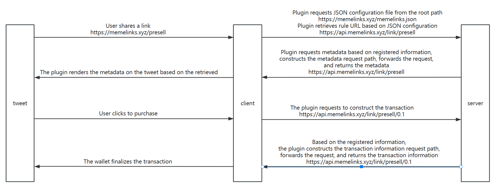

## MemeLink

### 网站技术实现流程介绍

#### 项目原理

本项目的主要目标是通过插件系统，使不同平台能够通过分享链接并获取元数据来使用我们的插件功能。整个系统通过一系列接口和规则来管理元数据的获取、交易签名的生成，以及平台的注册和信息管理。

#### 插件

插件是该系统的核心组件，负责以下任务：

1. **链接判断**：
   插件会根据用户分享出来的链接，调用接口获取所有注册的平台信息，判断链接的域名是否在注册列表中。

2. **请求规则文件**：
   如果链接的域名在注册列表中，插件会请求该域名根路径下的 `memelinks.json` 文件，获取该平台的规则信息。

3. **路径匹配和 API 请求**：
   插件根据规则信息，判断分享的链接路径是否符合规则。如果符合规则，插件会根据规则拼接 API 路径，发起请求获取元数据。

4. **元数据渲染**：
   插件会根据返回的元数据，渲染前端显示内容，提供用户交互。

5. **交易签名处理**：
   当用户在前端触发某个操作选项时，插件会根据元数据中的 `href` 字段，向服务器请求交易签名接口，获取并处理交易签名。

#### 接口

1. **元数据获取**：
   当用户分享链接后，系统会根据链接的域名和路径判断其是否符合注册列表中的规则。如果符合规则，则会根据规则拼接 API 路径，向我们的服务器请求元数据并返回给前端进行渲染。
2. **交易签名生成**：
   用户在前端点击某个操作选项时，前端会根据返回的元数据中的 `href` 字段，向我们的服务器请求生成交易签名的接口，获取裸交易信息。

### 平台用户申请流程

1. **准备注册信息**：
   平台用户需要准备以下信息，并编辑成 JSON 文件格式：

   - **host**: 平台网址
   - **api_host**: API 网址
   - **chain_id**: 链ID
   - **short_host**: 平台简称  用来做申请链接的字段

2. **编辑 JSON 文件**：
   将上述注册信息编辑成 JSON 格式文件。例如：

   ```json
   {
       "host": "app.uniswap.org",
       "api_host": "interface.gateway.uniswap.org",
       "chain_id": "1",
       "short_host": "uniswap"
   }
   ```

3. **提交申请**：
   将编辑好的 JSON 文件提交至我们的 GitHub 仓库，申请注册。

4. **审批通过并合并分支**：

   提交到此存储库 [memelink-registry](https://github.com/lfg-meme/memelink-registry)

   我们会审核提交的信息，审批通过后将分支合并。这样，插件才会支持平台的渲染和操作。

   

### 用户平台对接开发流程

以下是用户平台如何对接本项目插件系统的详细开发流程，包括如何获取元数据、获取交易签名以及在路径根目录下添加 JSON 文件。

#### 1. 获取元数据

##### 接口定义规范

- **请求方式**：GET

- **返回数据格式**：

  ```json
  export interface MetadataResponse {
    /** 标题 */
    title: string;
    /** 图标链接 */
    icon: string;
    /** 描述信息 */
    description: string;
    /** 标签 */
    label: string;
    /** 链ID */
    chainId: string;
    /** 神经元对象，包含多个操作选项 */
    neuron: {
      /** 操作选项数组 */
      impulses: Array<{
        /** 操作选项标签 */
        label: string;
        /** 操作选项链接 */
        href: string;
        /** 操作选项参数数组（可选） */
        parameters?: Array<{
          /** 参数名称 */
          name: string;
          /** 参数标签 */
          label: string;
        }>;
      }>;
    };
  }
  ```

#### 2. 获取交易签名

##### 接口定义规范

- **请求方式**：POST

- **请求体**：

  ```json
  export interface ActionPostRequest {
    /** 用户钱包地址 */
    account: string;
  }
  ```

- **返回数据格式**：

  ```json
  export interface ActionPostResponse {
    /** 链id */
    chainId: string;
    /** 裸交易信息 */
    transaction: string;
    /** optional message, can be used to e.g. describe the nature of the transaction */
    message?: string;
  }
  ```

#### 3. 在路径根目录下添加 JSON 文件

##### 示例 JSON 文件内容

用户需要在平台的根目录下添加一个 `memelinks.json` 文件，用于定义 API 路径规则。

```json
{
    "rules": [
        {
            "pathPattern": "/swap/**",
            "apiPath": "https://api.memelinks.xyz/api/uniswap/swap/**"
        }
    ]
}
```

#### 字段解释

- **pathPattern**：路径模式，用于匹配用户分享的链接路径。

  - 示例值：`"/trade/**"`
  - `/trade/` 后可以跟任意字符，表示所有以 `/trade/` 开头的路径都符合此规则。
  - 例如：`/trade/abc`、`/trade/123`、`/trade/anything`  `/trade?amount=`都符合此规则。

- **apiPath**：API 路径，定义了与路径模式对应的 API 地址，用于请求元数据和交易签名。

  - 示例值：`"https://api.memelinks.xyz/api/lfgmeme/trade/**"`

  - 说明：

    ```
    "https://api.memelinks.xyz/api/lfgmeme/trade/**"
    ```

     表示将匹配到的路径模式部分替换到 API 路径中的 

    ```
    **
    ```

     位置，用于转发请求。

    - 例如：如果用户分享的链接是 `https://userplatform.com/trade/abc?param=value`，
    
      注册信息：
    
      ```
      {
          "host": "userplatform.com",
          "api_host": "api.userplatform.com",
          "chain_id": "1",
          "short_host": "userplatform",
          "type": "trade",
          "meta_url": "/metadata",
          "sign_url": "/sign"
      }
      ```
    
      那么根据规则，访问根路径 `https://userplatform.com/memelinks.json`，返回数据
    
      ```
      {
          "rules": [
              {
                  "pathPattern": "/trade/**",
                  "apiPath": "https://api.memelinks.xyz/api/userplatform/trade/**"
              }
          ]
      }
      ```
    
      API 请求元数据路径在服务器将被拼接为 `https://api.userplatform.com/metadata/abc?param=value`。

### 对接示例

以下是用户平台如何对接本项目插件系统的详细开发流程，包括如何获取元数据、获取交易签名以及在路径根目录下添加 JSON 文件。

#### 1. 获取元数据

##### 接口定义规范

- **请求方式**：GET

- **URL**：`https://api.memelinks.xyz/link/presell/metadata`

- **返回数据格式**：

  ```json
  {
  	"title": "Buy with SOL",
  	"icon": "https://rwa.trading/lfg/images/ef1bcc1d-9d4b-4827-92f3-0dcada6ff6d3.png",
  	"description": "Participate in the presale by transferring SOL. Choose an amount of SOL from the options below, or enter a custom amount.",
  	"label": "Buy SOL",
  	"chainId": 901,
  	"neuron": {
  		"impulses": [
  			{
  				"label": "0.01 SOL",
  				"href": "/api/memelink/presell/0.01",
  				"parameters": null
  			},
  			{
  				"label": "0.05 SOL",
  				"href": "/api/memelink/presell/0.05",
  				"parameters": null
  			},
  			{
  				"label": "0.1 SOL",
  				"href": "/api/memelink/presell/0.1",
  				"parameters": null
  			},
  			{
  				"label": "Buy hhhh",
  				"href": "/api/memelink/presell/{amount}",
  				"parameters": [
  					{
  						"name": "amount",
  						"label": "Enter a custom SOL amount"
  					}
  				]
  			}
  		]
  	}
  }
  ```

#### 2. 获取交易签名

##### 接口定义规范

- **请求方式**：POST

- **URL**：`https://api.memelinks.xyz/link/presell/sign/0.01`

- **请求体**：

  ```json
  {
      "account": "0x"  // 用户钱包地址
  }
  ```

- **返回数据格式**：

  ```json
  {
      "chainId": "1",
      "transaction": "AQAAAAAAAAAAAAAAAAAAAAAAAAAAAAAAAAAAAAAAAAAAAAAAAAAAAAAAAAAAAAAAAAAAAAAAAAAAAAAAAAAAAACAAQABAxRtDq0xuBclWhibsf+JyfulLEt17O0TrSe9Yl85sTlMtLo41TN6W9M2eJJA5QMpp0r3H9MS7GbhndrNdSaXtXoAAAAAAAAAAAAAAAAAAAAAAAAAAAAAAAAAAAAAAAAAACpVjSJZQZV6wyW/ZBEmjr6bFhL9zVv6Zfg9ctQYHmSpAQICAAEMAgAAAICWmAAAAAAAAA=="
  }
  ```

#### 3. 在路径根目录下添加 JSON 文件

**URL**：`https://api.memelinks.xyz/memelinks.json`

##### 示例 JSON 文件内容

用户需要在平台的根目录下添加一个 `memelinks.json` 文件，用于定义 API 路径规则。

```json
{
    "rules": [
      {
        "pathPattern": "/presell/",
        "apiPath": "https://api.memelinks.xyz/api/memelink/presell/**"
      }
    ]
  }
```

#### 4. 申请注册的json文件

##### 示例 JSON 文件内容

用户需要在github上传文件，用于注册。

```json
{
    "host": "memelinks.xyz",
    "api_host": "api.memelinks.xyz",
    "chain_id": "1",
    "short_host": "memelink",
    "type": "presell",
    "meta_url": "/link/presell/metadata",
    "sign_url": "/link/presell/sign"
}
```

### 流程图


